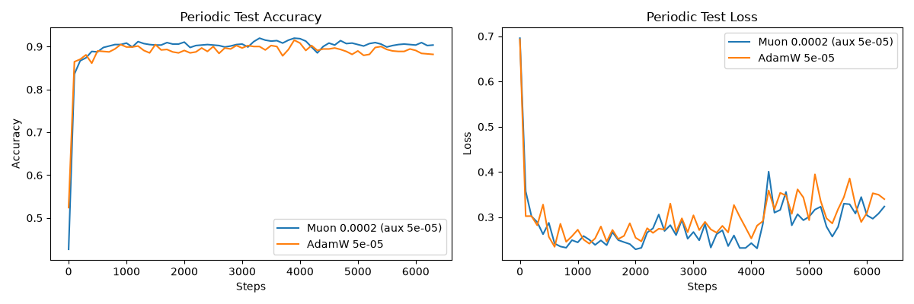
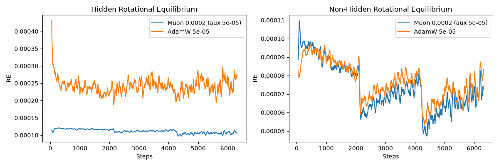
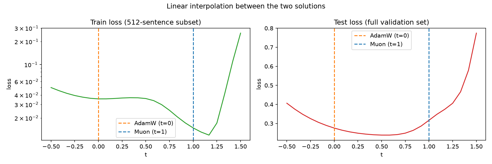

## Diagnosing Optimization During Fine-Tuning

### DISCLAIMER
All but `plot_sharpness.py` is hand-coded. This is due to the fact that the author is not as familiar with `matplotlib`. Even this `README.md` is hand-written. However, `Claude Fable 5.1 Medium` was used as a verbal assistant to guide the author to plan, find papers, and to understand the logic and math behind some of the functions. In addition, it was used to code `plot_sharpness.py`. **FOR SETUP INSTRUCTIONS, SCROLL TO THE BOTTOM.**

### Project Description
This project fine-tunes DistilBERT using AdamW and Muon on the SST-2 sentiment classification dataset. Since the original BERT paper was trained on the SST-2 dataset, DistilBERT was used to fulfill the requirement of a smaller model.

### Optimization and Performance Metrics
There were quite a few metrics that were recorded for specific reasons. 

1. **periodic_test_eval.png** This metric was recorded to get the test evals in between epochs. Since fine-tuning doesn't require as many epochs, and the models tend to overfit after few epochs, recording at every n steps allows to see how the model is performing on the test set in between epochs. The main metric to tune the frequency of logging is `eval_freq` in `train.py`. The current value is set to `100`.
2. **rotational_equilibrium.png** This metric, according to https://arxiv.org/pdf/2305.17212, shows the true learning rate. It's important for measuring behaviors between optimizers.
3. **loss_steps.png** This metric is a basic optimization trajectory to check for stability and behaviors.
4. **distance_pretrain_weights.png** This metric answers of how post-training is affecting the pre-trained weights. This metric was also suggested by https://arxiv.org/pdf/2605.10468.

`plots.py` does generate 3 more graphs: **gradient_norms.png**, **update_norms.png**, and **weight_norms.png**, each used for input, output and denominators for the **rotational_equilibrium.png**. It also generates a summary table with several metrics to highlight the differences between the two optimizers used (AdamW and Muon).

### Sharpness Metrics
For sharpness, 3 different methods were used.

1. **perturbation_sharpness.png** This metric was inspired by* https://arxiv.org/pdf/1609.04836. This metric looks around the two different post-trained model weights in the weight space to see the steepness of the landscape around where the weights ended up. It's like throwing a ball and seeing whether the hole that it fell into was wide or thin. The `sigmas` and `n_draws` metrics in `sharpness.py` affect the nudge distance and accuracy of std. In addition to this, noise is scaled to each parameter's own normalization, otherwise sharpness depends on weight scale.
2. **interpolation.png** This is a very important graph for this experiment, as it shows whether bot answers are in the same basin, and how steep the basin(s) is/are. This is a standard metric to view the landscape between the two models' weights. Currently, `"ts": np.linspace(-0.5, 1.5, 25)` in `sharpness.py` for this metric, which means that if you were to picture a number line, where the AdamW model is at 0 and the Muon model is at 1, then this metric is covering the landscape in a line from point -0.5 to 1.5, covering an extra 50% on both ends to see the landscape before the AdamW model and after the Muon model.
3. `top_eigenvalue()` in `sharpness.py` is the last method of evaluation. It takes the second derivative of the loss and measures the curvature to see where the curve is most sharp. `"n_iters": 20` is the metric that matters here. It means the Hessian matrix nudges a vector v to the largest eigenvalue.

There was no graph for the `top_eigenvalue()` method. Instead there was a table. 

### Results
| Label                   |   Best Periodic Test Accuracy |   Step at Best Periodic Test Accuracy |   Lowest Periodic Test Loss |   Step at Lowest Periodic Test Loss |   Final Test Accuracy |   Final Train Accuracy |   Final Hidden Pretrain Distance |   Final Hidden Weight Norm |
|-------------------------|-------------------------------|---------------------------------------|-----------------------------|-------------------------------------|-----------------------|------------------------|----------------------------------|----------------------------|
| Muon 0.0002 (aux 5e-05) |                      0.919725 |                                  3300 |                    0.228822 |                                2000 |              0.901376 |               0.981485 |                          21.4342 |                    279.385 |
| AdamW 5e-05             |                      0.915138 |                                  3900 |                    0.234399 |                                 600 |              0.891055 |               0.974194 |                          22.5403 |                    283.49  |

Muon with 2e-4 is ahead on every metric. Keep in mind this is all done on a **single seed** due to GPU limitations and time constraints.

In regards to the sweeps, AdamW was tested first as Muon would also use AdamW in the background for nonhidden parameters. First `adamw_lr=5e-5` was tested, then `5e-4` and `5e-6` to justify `5e-5`. `5e-5` was kept as it outperformed both, and once again, due to time constraints, exploration for AdamW was stopped there. For Muon, it started off with `muon_lr=2e-2`. `2e-1` was tested afterward, and then it descended down to `2e-5`. `2e-5` and `2e-4` were comparable, but `2e-4` seemed to do slightly better on Periodic Test Loss in `periodic_test_eval.png`. 

The final learning rates were `adam_lr=5e-5` and `muon_lr=2e-4`.

**Sharpness estimates**

| Group     |   Top eigenvalue AdamW |   Top eigenvalue Muon |   Loss rise @σ=0.05 AdamW |   Loss rise @σ=0.05 Muon | Paired diff (A−M) ± SE   | A>M draws   |
|-----------|------------------------|-----------------------|---------------------------|--------------------------|--------------------------|-------------|
| hidden    |                 10.901 |                17.251 |                   0.0009  |                  0.00065 | +0.00025 ± 0.00034       | 6/10        |
| nonhidden |                  5.167 |                 3.243 |                   0.00154 |                  0.00084 | +0.00070 ± 0.00036       | 8/10        |
| all       |                 13.773 |                19.794 |                   0.00294 |                  0.00173 | +0.00121 ± 0.00061       | 8/10        |

**Generalization gap along the interpolation line**

| Solution                   |   Train loss |   Test loss |    Gap |
|----------------------------|--------------|-------------|--------|
| AdamW (t=0)                |       0.0356 |      0.2757 | 0.2401 |
| Muon (t=1)                 |       0.0148 |      0.3167 | 0.3018 |
| Test-loss minimum (t=0.58) |       0.0119 |      0.2388 |        |

**One thing to take away from this is that the estimators disagree in a principled way. Muon is flatter by the mean curvature, but is sharper by the top eigen value and interpolation cliff, with a larger generalization gap.**

### Figures



This is an image of the main differences between the optimizers for periodic test metrics.



Muon reaches a lower training loss, and there is a larger generalization gap which means that it is overfitting harder than AdamW. 



This graph shows the landscape surrounding the two models' weight parameters. It can seen that in the train loss, there is a dip towards the Muon section, which shows that there is no barrier in the basin, AdamW is in a more shallow region, and Muon is in a deeper region (in train).

## Setup

To run this setup start off by creating an environment. The author used `miniconda`. It is also suggested to have a GPU of some sort. The author used a `Laptop RTX 4070 GPU`, and if using a GPU, make sure to have the proper drivers installed with it.

```
conda create --name myenv python=3.12
conda activate myenv
```

Now install the requirements with the following command:

```
pip install -r requirements.txt
```

Once installed, two models need to be trained. The first set of configurations have already been set up for you:

```
python train.py
```

This should create an `artifacts` folder and a `adamw` subfolder with a timestamped folder within. Keep in mind this will purely save the run information, along with the trained model. **DO NOT DELETE THE MODEL.**

Now, you would need to change a parameter. Go to `train.py`, and scroll down to line `193`. Switch `"muon": False` to `"muon": True`. Then run the following command:

```
python train.py
```

Now you have trained your models! The next step is to generate the plots. **READ CAREFULLY!** From the generated artifacts, you have to copy the relative or absolute path of the timestamped folders (two of them). It will look like this:

```
python plots.py artifacts/adamw/20260911_110518 artifacts/muon/20260911_121342
```

**MAKE SURE THAT YOU SELECT THE FOLDER, AND THAT THEY ARE BOTH DIFFERENT. THIS IS IMPORTANT TO GENERATE THE PLOTS THAT COMPARE THE RESULTS OF THE TWO TRAINED MODELS. DO NOT COPY AND PASTE THIS AND EXPECT IT TO WORK. IT WILL NEVER.** 

Now that you have your generated plots, you have to change the directories of the AdamW and Muon models in the config file. Make sure it looks like something below, but with your own models. You have to select the `model/` folder, otherwise it won't work:

```
"model_dir_adamw": "artifacts/adamw/20260911_110518/model",
"model_dir_muon": "artifacts/muon/20260911_134357/model",
```

Then run the following command:

```
python sharpness.py
```

Then lastly, run the following command:

```
python plot_sharpness.py 
```

Then you will get the same results! And there it is. :D

